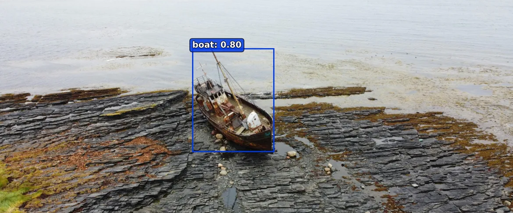

# Hi, I'm Erkan 👋  
### **Machine Perception Engineer**  

I’m a **Machine Perception Engineer** specializing in developing cutting-edge LiDAR, camera, and sensor fusion systems for autonomous vehicles. My work focuses on building **robust, scalable perception solutions** to advance self-driving technologies

🔭 **Currently:** Pushing the boundaries of 3D perception at Sandvik.  
🌱 **Learning/Exploring:** Perception for remote sensing.    
💬 **Ask me about:** LiDAR perception, object detection with camera or sensor fusion.

---

## 💻 Projects

| Project | Description | Tech Stack |  
|---------|-------------|------------|  
| **[PiSAR](https://github.com/eadali/PiSAR)** | AI-powered visual detection system for aerial search operations. |    |  
| **[MACOW](https://github.com/eadali/)** | MACOW: Maritime Collision Warning System(COMING SOON). |     |  
---

## 📫 **Let’s Connect**  
 
